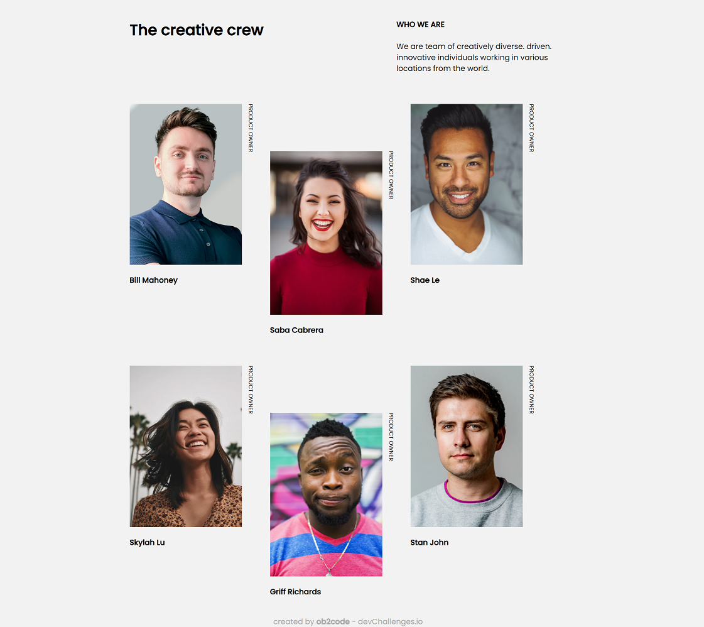
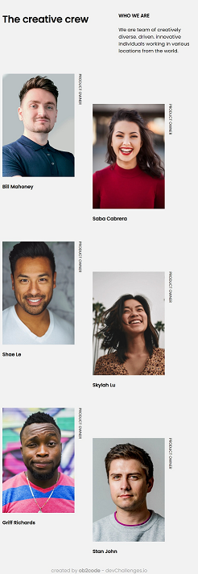
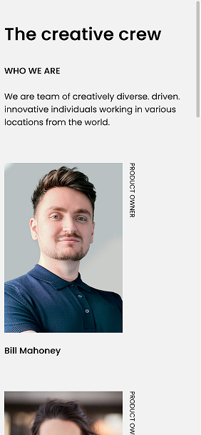

<!-- Please update value in the {}  -->

<h1 align="center">My team page</h1>

   Solution for a challenge from  <a href="http://devchallenges.io" target="_blank">Devchallenges.io</a>.

  <h3>
    <a href="https://ob2code-my-team-page.netlify.app/">
      Demo
    </a>
     | 
    <a href="https://github.com/ob2code/my-team-page-master.git">
      Solution
    </a>
     | 
    <a href="https://devchallenges.io/challenges/hhmesazsqgKXrTkYkt0U">
      Challenge
    </a>
  </h3>

<!-- TABLE OF CONTENTS -->

## Table of Contents

- [Overview](#overview)
  - [Built With](#built-with)
- [Features](#features)
- [Contact](#contact)
- [Acknowledgements](#acknowledgements)

<!-- OVERVIEW -->

## Overview

Desktop screenshot

Tablet screenshot

Mobile screenshot

Hello!

This is my second project form devchallenges.io.

- What was your experience?
  - Failed to try some methods to vertical the title along the picture until using Flexbox 😅
- What have you learned/improved?
  - Do not know how to automatically indent the second column down in responsive. Have to hardcoded the padding according to the media queries (will get back to improve this challenge).

### Built With

<!-- This section should list any major frameworks that you built your project using. Here are a few examples.-->

- HTML & CSS

## Features

<!-- List the features of your application or follow the template. Don't share the figma file here :) -->

This application/site was created as a submission to a [DevChallenges](https://devchallenges.io/challenges) challenge. The [challenge](https://devchallenges.io/challenges/hhmesazsqgKXrTkYkt0U) was to build an application to complete the given user stories.

## Acknowledgements

<!-- This section should list any articles or add-ons/plugins that helps you to complete the project. This is optional but it will help you in the future. For exmpale -->

- [Steps to replicate a design with only HTML and CSS](https://devchallenges-blogs.web.app/how-to-replicate-design/)

## Contact

- 💻Website (under construction) [ob2code.netlify.app](https://ob2code.netlify.app/)
- 👨‍💻GitHub [@ob2code](https://github.com/ob2code)
- 🐤Twitter [@ob2code](https://twitter.com/ob2code)
